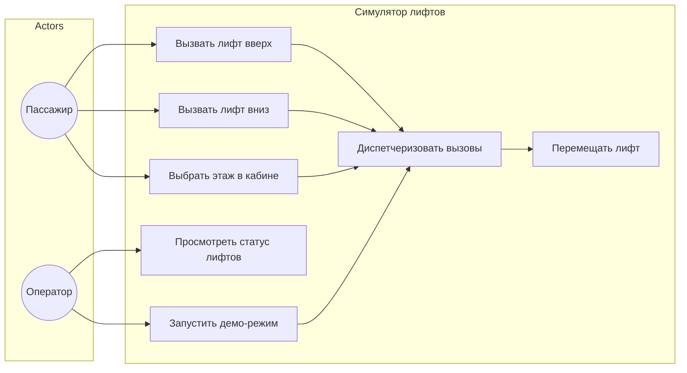
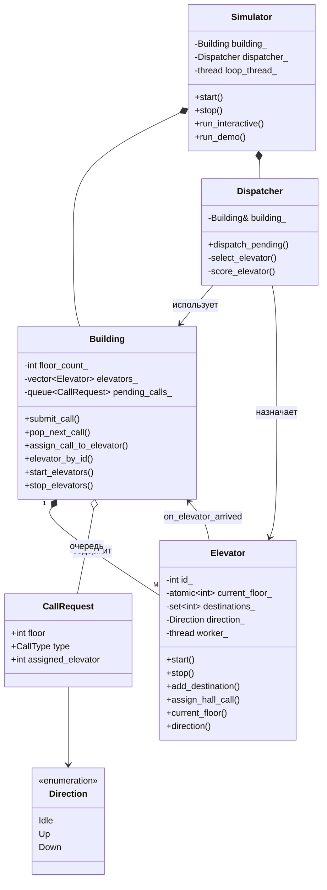
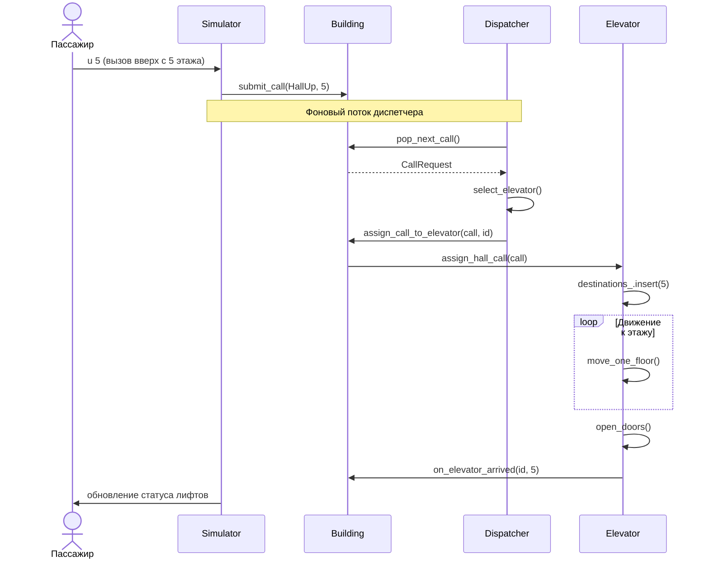

\newpage

# 1. Введение

## 1.1. Цель

Данный документ описывает требования к программному обеспечению **«Симулятор работы лифтов в здании»** — многопоточной системе моделирования работы группы лифтов, обрабатывающих вызовы с этажей и из кабин.

Документ предназначен для разработчиков, преподавателей и заказчиков учебного проекта.

## 1.2. Область действия (Scope)

**В scope:**

- Моделирование здания с настраиваемым числом этажей и лифтов
- Многопоточная работа лифтов и диспетчера
- Обработка вызовов с этажей и из кабины
- Консольный интерфейс (интерактивный и демо-режим)

**Вне scope:**

- Графический 3D-интерфейс
- Интеграция с реальным оборудованием лифтов
- Сетевая многопользовательская работа
- Сохранение истории в базу данных

## 1.3. Определения и аббревиатуры

| Термин | Определение |
|--------|-------------|
| SRS | Software Requirements Specification — спецификация требований |
| Hall Call | Вызов лифта с этажа (кнопка «вверх» или «вниз») |
| Cabin Call | Вызов этажа из кабины лифта |
| Dispatcher | Диспетчер — компонент, назначающий вызовы лифтам |
| Elevator | Лифт — исполнитель, перемещающийся между этажами |
| SCAN | Алгоритм обслуживания вызовов в текущем направлении движения |

---

# 2. Общее описание

## 2.1. Описание продукта

Продукт — консольное приложение на C++, имитирующее работу лифтовой системы в многоэтажном здании. Каждый лифт работает в отдельном потоке, диспетчер в фоновом потоке распределяет входящие вызовы. Пользователь наблюдает состояние лифтов и может создавать вызовы вручную или через демо-режим.

## 2.2. Функции продукта

- Инициализация здания и лифтов
- Приём и очередь вызовов
- Диспетчеризация вызовов по эвристическому алгоритму
- Движение лифтов, остановка и имитация открытия дверей
- Отображение статуса в консоли
- Интерактивное управление и автоматическая демонстрация

## 2.3. Характеристики пользователей

| Роль | Описание | Навыки |
|------|----------|--------|
| Оператор/студент | Запускает симуляцию, вводит вызовы | Базовые навыки работы с консолью |
| Разработчик | Настраивает параметры, изучает алгоритмы | C++, многопоточность |
| Преподаватель | Проверяет соответствие ТЗ | Понимание UML и SRS |

---

# 3. Детальные требования

## 3.1. Методология сбора требований

1. **Анализ предметной области** — изучение принципов работы лифтовых систем (hall call, cabin call, диспетчеризация).
2. **User Stories** — формулировка потребностей пассажира, диспетчера и разработчика.
3. **Story Mapping** — выделение сценариев: «вызов с этажа», «поездка в кабине», «наблюдение за системой».
4. **Иерархия Вигерса** — классификация требований на бизнес-, пользовательские, функциональные и нефункциональные (см. `docs/requirements.md`).

## 3.2. Бизнес-требования

- BR-01 … BR-04 (см. `docs/requirements.md`)

## 3.3. Пользовательские требования

- UR-01 … UR-05 (см. `docs/requirements.md`)

## 3.4. Функциональные требования

- FR-01 … FR-10 (см. `docs/requirements.md`)

## 3.5. Нефункциональные требования

- NFR-01 … NFR-06 (см. `docs/requirements.md`)

---

# 4. Диаграммы UML

## 4.1. Диаграмма вариантов использования (Use Case)

**Акторы:** Пассажир, Оператор.  
**Прецеденты:** отражают FR-02 … FR-10.

## 4.2. Диаграмма классов (Class Diagram)

## 4.3. Диаграмма последовательности — «Вызов лифта с этажа»

---

# 5. Архитектура реализации

| Модуль | Файлы | Ответственность |
|--------|-------|-----------------|
| types | `include/types.hpp` | Перечисления, структура CallRequest |
| Building | `building.hpp/cpp` | Здание, очередь вызовов, управление лифтами |
| Elevator | `elevator.hpp/cpp` | Поток лифта, движение, двери |
| Dispatcher | `dispatcher.hpp/cpp` | Выбор лифта для вызова |
| Simulator | `simulator.hpp/cpp` | UI, демо, главный цикл |
| main | `src/main.cpp` | Точка входа, разбор аргументов |

---

# 6. Приложение — PlantUML

Исходники диаграмм: `docs/uml/use_case.puml`, `class_diagram.puml`, `sequence_diagram.puml`.
